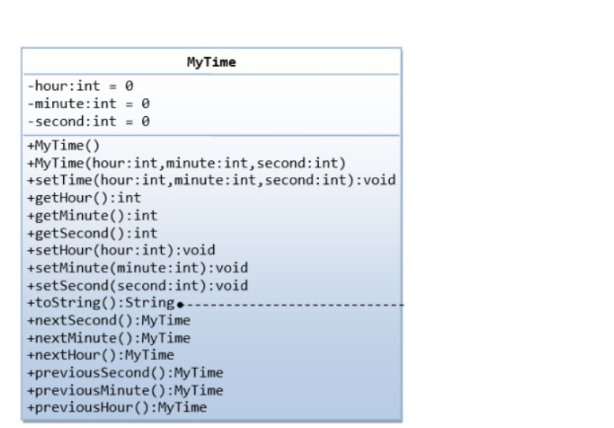

<b>

Lớp phân số


Viết chương trình khai báo lớp Phân số gồm hai thuộc tính private là tử số và mẫu
số. Sau đó thực hiện nhập vào một phân số và in ra phân số đó ở dạng tối giản
Input Format
Có hai số nguyên dương lần lượt là tử số và mẫu số.
Constraints
Các giá trị đều nguyên dương và không quá 18 chữ số.
Output Format
Ghi ra phân số tối giản;


Sample Input 0:
```
334 37
```

Sample Output 0
```
334/37
```


Sample Input 1:
```
312 945
```
Sample Output 1:
```
104/315
```


Bài 2. Lớp sinh viên

Viết chương trình khai báo lớp Thí Sinh gồm các thông tin: Họ tên, Ngày sinh,
Điểm môn 1, Điểm môn 2, Điểm môn 3 và Tổng điểm. Đọc thông tin 1 thí sinh từ
bàn phím và in ra màn hình 3 thông tin: Họ tên, Ngày sinh, Tổng điểm.
Input Format
Gồm 5 dòng lần lượt, mỗi dòng ghi 1 thông tin: Họ tên, Ngày sinh, Điểm môn 1,
Điểm môn 2, Điểm môn 3.
Constraints
Các giá trị điểm là số thực (float). Họ tên không quá 50 chữ cái. Ngày sinh viết
đúng chuẩn dd/mm/yyyy.Output Format
Ghi ra Họ tên, Ngày sinh và Tổng điểm. Mỗi thông tin cách nhau một khoảng
trống. Điểm được ghi ra với 1 số sau dấu phẩy.
Sample Input 0
```
Hoang Dinh Nam
28/09/2000
6.1
6.9
6.4

```


Sample Output 0
```
Hoang Dinh Nam 28/09/2000 19.4

```


Bài 3. Lớp Sinh Viên


Viết chương trình khai báo lớp Sinh Viên gồm các thông tin: Mã SV, Họ tên, Lớp,
Ngày sinh và Điểm GPA (dạng số thực float). Hàm khởi tạo không có tham số, gán
các giá trị thuộc tính ở trạng thái mặc định (xâu ký tự rỗng, giá trị số bằng 0).
Đọc thông tin 1 sinh viên từ bàn phím (không có mã sinh viên) và in ra màn hình.
Trong đó Mã SV được gán là SV001. Ngày sinh được chuẩn hóa về dạng
dd/mm/yyyy.
Input Format
Gồm 4 dòng : 1. Họ tên không quá 30 chữ cái.
2. Lớp là một chuỗi không có dấu cách
3. Ngày sinh có đủ 3 phần ngày tháng năm nhưng có thể chưa đúng chuẩn
dd/mm/yyyy.
4. Điểm GPA đảm bảo trong thang điểm 4 với 2 nhiều nhất 2 số sau dấu
phẩy.
Constraints
N/A
Output Format
Ghi thông tin sinh viên trên 1 dòng, mỗi thông tin cách nhau 1 khoảng trống, gpa
lấy 1 chữ số sau dấu phẩy
Sample Input 0

```
Nguyen Van Nam
CNTT1
16/8/2001
2.8
```
Sample Output 0
```
SV001 Nguyen Van Nam CNTT1 16/08/2001 2.8
```


Bài 4. Lớp nhân viên


Một nhân viên làm việc trong công ty được lưu lại các thông tin sau:

1. Mã nhân viên: được gán giá trị là 00001

1. Họ tên: Xâu ký tự không quá 50 chữ cái.

1. Giới tính: Nam hoặc Nu

1. Ngày sinh: đúng theo chuẩn dd/mm/yyyy

1. Địa chỉ: Xâu ký tự không quá 100 chữ cái

1. Mã số thuế: Dãy số có đúng 10 chữ số

1. Ngày ký hợp đồng: đúng theo chuẩn dd/mm/yyyy
Viết chương trình nhập một nhân viên (không nhập mã) in ra màn hình thông tin
của nhân viên đó.
Input Format
Gồm 6 dòng lần lượt ghi các thông tin theo thứ tự đã ghi trong đề bài. Không có
mã nhân viên.
ConstraintsN/A
Output Format

Ghi ra đầy đủ thông tin nhân viên trên một dòng, các thông tin cách nhau đúng
một khoảng trống.
Sample Input 0

```
Nguyen Thi Nhung
Nu
28/09/1999
Ha Nam
8850288467
13/07/2021
```
Sample Output 0
```
00001 Nguyen Thi Nhung Nu 28/09/1999 Ha Nam 8850288467 13/07/2021
```


Viết chương trình khai báo lớp Rectange với các thuộc tính và phương thức như
sau:


Viết chương trình nhập vào giá trị độ dài hai cạnh của hình chữ nhật và màu sắc.
In ra thông tin về chu vi, diện tích và màu sắc (đã đưa về dạng chuẩn trong đó ký
tự đầu viết hoa, các ký tự sau viết thường) của hình chữ nhật đó.
Input Format
Gồm 2 số nguyên a, b là độ dài 2 cạnh hình chữ nhật và một xâu ký tự (không có
khoảng trống) mô tả màu sắc.
Constraints
-1000<=a,b<=1000;
Output Format
Nếu hình chữ nhật là hợp lệ (các cạnh đều nguyên dương) thì in ra 3 thông tin:
chu vi, diện tích, màu sắc, mỗi thông tin cách nhau một khoảng trống. Nếu dữ
liệu không hợp lệ in ra INVALID
Sample Input 0
```
22 25 Gray
```
Sample Output 0
```
94 550 Gray
```


Bài 9. Thu nhập của giáo viên
Trường phổ thông XYZ tính lương giáo viên theo quy tắc sau: Mỗi giáo viên có mã
ngạch gồm 4 ký tự trong đó. 2 ký tự đầu là chức vụ (HT: Giáo viên kiêm nhiệm
Hiệu trưởng, HP: Giáo viên kiêm nhiệm Hiệu phó, GV: Giáo viên thường). 2 ký tự
số cuối cùng cho biết hệ số bậc lương (không quá 20). Lương cơ bản của mỗi giáo
viên cũng có thể khác nhau. Phụ cấp quy định như sau. HT: 2.000.000. HP:
900.000. GV: 500.000. Thu nhập được tính bằng lương cơ bản nhân với hệ số bậc
lương cộng thêm phụ cấp. Hãy tính lương cho 1 giáo viên theo quy tắc trên.
Input Format
Có 3 dòng lần lượt là mã ngạch, họ tên và lương cơ bản.
Constraints
Lương cơ bản là số nguyên không quá 10^7
Output Format
Chỉ có một dòng ghi lần lượt các thông tin: mã ngạch, họ tên, bậc lương, thu
nhập.
Sample Input 0
```
HP05
Nguyen Van Ha
1748000
```
Sample Output 0
```
HP05 Nguyen Van Ha 5 9640000
```


Bài 11. Tính lương nhân viên

Thông tin về nhân viên bao gồm: Mã nhân viên (tự động tăng theo thứ tự nhập,
tính từ NV01, nếu chỉ có 1 nhân viên thì mã là NV01) - Họ và tên - Lương cơ bản
mỗi ngày công - Số ngày công - Chức vụ Tiền lương được tính bằng lương cơ bản
nhân với số ngày công. Giả sử quy tắc tính tiền thưởng như sau:
 Số ngày công từ 25 trở lên thì thưởng 20% tiền lương
 Số ngày công từ 22 đến dưới 25 thì thưởng 10% tiền lương
 Dưới 22 ngày công thì không có thưởng. Mỗi nhân viên có thể có thêm phụ
cấp chức vụ:
 GD: 250000
 PGD: 200000
 TP: 180000
 NV: 150000 Hãy nhập thông tin 1 nhân viên và tính toán thu nhập theo
quy tắc trên.
Input Format
Gồm 4 dòng lần lượt ghi Họ tên, lương cơ bản, số ngày công và chức vụ; Số ngày
công là số nguyên không âm không vượt quá 31;
Constraints
Lương cơ bản là số nguyên dương không quá 10^7;
Output Format
Ghi ra một dòng gồm: mã nhân viên, tên nhân viên, lương tháng, thưởng, phụ
cấp và thu nhập. Mỗi thông tin cách nhau một khoảng trống.
Sample Input 0
```
Nguyen Van Teo
26000
21
PGD
```
Sample Output 0
```
NV01 Nguyen Van Teo 546000 0 200000 746000
```


 Bài 12. Tuyển sinh
Trường Đại học XYZ tuyển sinh theo hình thức xét điểm thi ba môn Toán – Lý –
Hóa. Để đơn giản, khu vực tuyển sinh được quy định luôn bởi ba chữ cái đầu tiêntrong mã thí sinh. Do rất thích các thí sinh đến từ Khu vực 3 nên trường XYZ tự
quy định giá trị điểm ưu tiên Khu vực như trong bảng sau:


Giả sử biết trước điểm chuẩn là 24. Hãy xác định tình trạng tuyển sinh của thí
sinh.
Input Format
Chỉ bao gồm thông tin của một thí sinh trên 5 dòng lần lượt là: - Mã thí sinh - Họ
tên - Điểm toán - Điểm lý - Điểm hóa
Constraints
Các giá trị điểm đều đảm bảo trong phạm vi [0,10] và có thể có 1 chữ số phần
thập phân.
Output Format
Ghi ra các thông tin: - Mã thí sinh - Họ tên - Khu vực - Tổng điểm – có tính ưu tiên
(có thể có 1 số phần thập phân), trong trường hợp điểm là số thực với phần thập
phân bằng 0 thì không in ra phần thập phân. - Trạng thái: TRUNG TUYEN hoac
TRUOT (sau khi đã tính cả điểm ưu tiên)
Sample Input 0
```
KV2B
Hoang Ngoc Long
3.4
9
0
```
Sample Output 0
```
KV2B Hoang Ngoc Long 2 13.4 TRUOT
```


Bài 13. Lớp phân sốPhân số là sự biểu diễn số hữu tỷ dưới dạng tỷ lệ của hai số nguyên, trong đó số ở
trên được gọi là tử số, còn số ở dưới được gọi là mẫu số. Cho hai phân số A và B
có tử số và mẫu số được nhập từ bàn phím. Viết chương trình thực hiện hai nhiệm
vụ sau: 1. Thực hiện phép tính C = (A + B)^2 và rút gọn kết quả. 2. Thực hiện
phép tính D = A x B x C và rút gọn kết quả.
Input Format
Dòng đầu tiên là số bộ test T; T dòng tiếp theo, mỗi dòng gồm 4 số lần lượt là tử
và mẫu số của phân số A và phân số B
Constraints
(T <= 100); Các phân số có tử số và mẫu số là số nguyên trị tuyệt đối <= 100;
Dữ liệu đảm bảo mẫu số khác 0.
Output Format
Ghi ra kết quả của hai phép tính theo định dạng phân số, cách nhau một khoảng
trống.
Sample Input 0
```
6
1 2 3 4
2 3 4 5
-23 -36 99 90
24 -1 99 60
-40 -9 98 91
37 -31 61 92
```
Sample Output 0

```
25/16 75/128
484/225 3872/3375
97969/32400 24786157/11664000
199809/400 19781091/-1000
417316/13689 233696960/1601613
2289169/8133904 5166654433/-23197894208
```


Bài 15. Lớp Set 1
Trong lý thuyết tập hợp, một tập hợp chỉ được phép chứa các giá trị phân biệt và
luôn luôn lưu các giá trị theo thứ tự tăng dần. Khai báo lớp IntSet và viết các
phương thức để thực hiện các thao tác trên tập hợp số nguyên. Sử dụng lớp
IntSet để in ra tập hợp các số nguyên là giao của hai tập số trong 2 dãy ban đầu.
Sử dụng hàm main có nội dung như sau :Input Format
Dòng đầu ghi 2 số n và m (1 < n,m <100). Dòng thứ 2 ghi n số của a[]. Dòng thứ
3 ghi m số của b[]. Các số đều dương và nhỏ hơn 1000.
Constraints
N/A
Output Format
Ghi ra hợp của hai tập theo thứ tự tăng dần.
Sample Input 0
```
14 5
92 36 73 11 78 19 57 76 96 58 36 38 29 42
19 21 15 4 78
```
Sample Output 0
```
19 78
```


Bài 16. Lớp Set 2
Trong lý thuyết tập hợp, một tập hợp chỉ được phép chứa các giá trị phân biệt và
luôn luôn lưu các giá trị theo thứ tự tăng dần. Khai báo lớp IntSet và viết các
phương thức để thực hiện các thao tác trên tập hợp số nguyên. Sử dụng lớp
IntSet để in ra tập hợp các số nguyên là hợp của hai tập số trong 2 dãy ban đầu.
Yêu cầu sử dụng hàm main có nội dung như sau để chạy chương trình.Input Format
Dòng đầu ghi 2 số n và m (1 < n,m <100). Dòng thứ 2 ghi n số của a[]. Dòng thứ
3 ghi m số của b[]. Các số đều dương và nhỏ hơn 1000;
Constraints
N/A
Output Format
Ghi ra hợp của hai tập theo thứ tự tăng dần.
Sample Input 0
```
12 5
89 16 18 57 93 25 40 25 75 71 30 18
23 93 8 16 80
```
Sample Output 0
```
8 16 18 23 25 30 40 57 71 75 80 89 93
```


Bài 17. Lớp set 3
Trong lập trình cơ bản, một từ được hiểu là một dãy ký tự liên tiếp không chứa
khoảng trống, dấu tab hoặc dấu xuống dòng. Xây dựng lớp WordSet để quản lý
tập hợp các từ khác nhau trong một xâu ký tự, sau khi đã chuyển hết về dạng
chữ thường. Khi liệt kê thì tập từ thì sẽ luôn theo thứ tự từ điển tăng dần Viết
chương trình nhập hai dòng ký tự và hiển thị hợp và giao của hai tập từ tương
ứng. Sử dụng hàm main có nội dung sẵn như sau :Input Format
Chỉ có 2 dòng, mỗi dòng có độ dài không quá 1000 ký tự.
Constraints
N/A
Output Format
Dòng 1 ghi hợp của 2 tập từ theo thứ tự từ điển Dòng 2 ghi giao của 2 tập từ theo
thứ tự từ điển.
Sample Input 0
```
aabc cbcac bbaa aaa acaba ccc abaaa
caa aaa abaa aba abc acb aacb aabaa
```
Sample Output 0
```
aaa aabaa aabc aacb aba abaa abaaa abc acaba acb bbaa caa cbcac ccc
aaa
```


Bài 18. Lớp ma trận
Viết chương trình khai báo lớp Matrix mô tả ma trận các số nguyên. Sau đó nhập
và tính tích hai ma trận A cỡ n*m và ma trận B cỡ m*p. Với 1 < n,m,p < 50. Các
giá trị trong ma trận đều nguyên dương và không vượt quá 1000. Sử dụng hàm
main có sẵn :Input Format
Dòng đầu ghi 3 số n,m,p; n dòng tiếp theo ghi ma trận A; m dòng tiếp theo ghi
ma trận B;
Constraints
N/A
Output Format
In ra tích của ma trận
Sample Input 0
```
3 2 4
147 790
393 462
675 445
690 172 776 550
344 761 900 713
```
Sample Output 0
```
373190 626474 825072 644120
430098 419178 720768 545556
618830 454745 924300 688535
```


Bài 19. Lớp ma trận 2
Khai báo lớp Matrix mô tả ma trận các số nguyên. Nhập ma trận A cấp N * M. Hãy
viết chương trình tính tích của A với ma trận chuyển vị của A.
Sử dụng hàm main có nội dũng sẵn như sau :Input Format
Dòng đầu tiên ghi hai số n và m là bậc của ma trân a; n dòng tiếp theo, mỗi dòng
ghi m số của một dòng trong ma trận A.
Constraints
n và m đều nguyên dương và nhỏ hơn 50. Các giá trị trong ma trận không vượt
quá 100.
Output Format
Với mỗi bộ test ghi ra ma trận tích tương ứng, mỗi số cách nhau đúng một
khoảng trống.
Sample Input 0
```
5 2
198 725
686 514
183 392
392 717
134 62
```
Sample Output 0
```
564829 508478 320434 597441 71482
508478 734792 327026 637450 123792
320434 327026 187153 352800 48826
597441 637450 352800 667753 96982
71482 123792 48826 96982 21800
```


Bài 20. Lớp TimeGiá trị độ đo thời gian được biểu diễn bởi ba thành phần: giờ, phút, giây. Cho N
giá trị thời gian, hãy sắp xếp danh sách theo thứ tự tăng dần.
Input Format
Dòng đầu ghi số nguyên dương N (không quá 5000) là số lượng giá trị thời gian
cần sắp xếp. Mỗi giá trị thời gian biểu diễn trên một dòng bằng ba số nguyên
dương, lần lượt là số giờ, số phút, số giây. Trong đó số giờ đảm bảo nhỏ hơn 100,
số phút và số giây đảm bảo đúng quy tắc (tức là không quá 59).
Constraints
N/A
Output Format
In ra danh sách đã sắp xếp theo thứ tự tăng dần.
Sample Input 0
```
5
25 2 33
18 3 17
12 6 19
1 6 12
98 51 26
```
Sample Output 0
```
1 6 12
12 6 19
18 3 17
25 2 33
98 51 26
```


Bài 21. Danh sách mặt hàng
Bài toán quản lý danh sách mặt hàng trong đó mỗi mặt hàng sẽ có các thông tin:
- Mã mặt hàng: tự động tăng, tính từ MH0001.
 Tên mặt hàng: xâu ký tự độ dài không quá 100.
 Đơn vị tính: xâu ký tự độ dài không quá 10.
 Giá mua: số nguyên dương không quá 7 chữ số.
 Giá bán: số nguyên dương không quá 7 chữ số.Viết chương trình nhập danh sách mặt hàng, sắp xếp theo lợi nhuận (giá bán trừ
đi giá mua) giảm dần. Nếu lợi nhuận bằng nhau thì in ra theo thứ tự mã tăng dần.
Input Format
Dòng đầu ghi số M là số mặt hàng (không quá 5000). Tiếp theo là thông tin của M
mặt hàng, mỗi mặt hàng ghi trên 4 dòng theo đúng thứ tự đã mô tả (không có
mã)
Constraints
N/A
Output Format
Ghi ra danh sách mặt hàng có đầy đủ thông tin ở trên và lợi nhuận tính được (mỗi
thông tin cách nhau một khoảng trống)
Sample Input 0
```
6
Ca phe
Thung
388000
492000
Dep
Thung
376000
495000
Giay Nguoi Lon
Cai
389000
580000
Giay Nguoi Lon
Thung
383000
503000
Dep
Thung
484000
647000
Vay Nu
Cai
366000
516000
```
Sample Output 0
```
MH0003 Giay Nguoi Lon Cai 389000 580000 191000
MH0005 Dep Thung 484000 647000 163000
MH0006 Vay Nu Cai 366000 516000 150000MH0004 Giay Nguoi Lon Thung 383000 503000 120000
MH0002 Dep Thung 376000 495000 119000
MH0001 Ca phe Thung 388000 492000 104000
```


Bài 22. Sinh viên 1
Viết chương trình khai báo lớp Sinh Viên gồm các thông tin: Mã SV, Họ tên, Ngày
sinh, Lớp và Điểm GPA (dạng số thực). Hàm khởi tạo không có tham số, gán các
giá trị thuộc tính ở trạng thái mặc định (xâu ký tự rỗng, giá trị số bằng 0). Đọc
thông tin N sinh viên từ bàn phím (không có mã sinh viên) và in ra lần lượt màn
hình mỗi dòng 1 sinh viên theo đúng thứ tự ban đầu. Trong đó Mã SV được tự tạo
ra theo quy tắc thêm mã SV sau đó là giá trị nguyên tự động tăng tính từ 001 (tối
đa là 099). Ngày sinh được chuẩn hóa về dạng dd/mm/yyyy
Input Format
Dòng đầu tiên ghi số sinh viên N (0 < N < 50). Mỗi sinh viên ghi trên 4 dòng lần
lượt là Họ tên, Lớp, Ngày sinh và Điểm GPA. Trong đó: • Họ tên không quá 30 chữ
cái. • Lớp là một chuỗi không có dấu cách. • Ngày sinh có đủ 3 phần ngày tháng
năm nhưng có thể chưa đúng chuẩn dd/mm/yyyy. • Điểm GPA đảm bảo trong
thang điểm 4 với 2 nhiều nhất 2 số sau dấu phẩy.
Constraints
N/A
Output Format
Ghi ra danh sách lần lượt các sinh viên có đầy đủ Mã sinh viên, Họ tên, Lớp, Ngày
sinh (đã chuẩn hóa về dạng dd/mm/yyyy), Điểm GPA (với đúng 2 số sau dấu
phẩy). Mỗi sinh viên ghi trên 1 dòng, mỗi thông tin cách nhau 1 khoảng trống.
Sample Input 0
```
5
Nguyen Van A
CNTT2
19/11/2000
3.60
Nguyen Van B
CNTT1
19/3/1999
0.10
Nguyen Van C
DTVT2
21/11/20011.30
Nguyen Van D
DTVT2
20/1/2000
2.70
Nguyen Van E
DTVT2
17/5/2003
0.30
```
Sample Output 0
```
SV001 Nguyen Van A CNTT2 19/11/2000 3.60
SV002 Nguyen Van B CNTT1 19/03/1999 0.10
SV003 Nguyen Van C DTVT2 21/11/2001 1.30
SV004 Nguyen Van D DTVT2 20/01/2000 2.70
SV005 Nguyen Van E DTVT2 17/05/2003 0.30
```


Bài 23. Sinh viên 2
Viết chương trình khai báo lớp Sinh Viên gồm các thông tin: Mã SV, Họ tên, Ngày
sinh, Lớp và Điểm GPA (dạng số thực). Hàm khởi tạo không có tham số, gán các
giá trị thuộc tính ở trạng thái mặc định (xâu ký tự rỗng, giá trị số bằng 0). Đọc
thông tin N thí sinh từ bàn phím (không có mã sinh viên) và in ra lần lượt màn
hình mỗi dòng 1 sinh viên theo đúng thứ tự ban đầu. Trong đó Mã SV được tự tạo
ra theo quy tắc thêm mã SV sau đó là giá trị nguyên tự động tăng tính từ 001 (tối
đa là 099). Họ tên được xử lý đưa về dạng chuẩn(viết hoa chữ cái đầu của từng từ
trong tên). Ngày sinh được chuẩn hóa về dạng dd/mm/yyyy
Input Format
Dòng đầu tiên ghi số sinh viên N (0 < N < 50). Mỗi sinh viên ghi trên 4 dòng lần
lượt là Họ tên, Lớp, Ngày sinh và Điểm GPA. Trong đó: • Họ tên không quá 30 chữ
cái. • Lớp là một chuỗi không có dấu cách. • Ngày sinh có đủ 3 phần ngày tháng
năm nhưng có thể chưa đúng chuẩn dd/mm/yyyy. • Điểm GPA đảm bảo trong
thang điểm 4 với 2 nhiều nhất 2 số sau dấu phẩy.
Constraints
N/A
Output Format
Ghi ra danh sách lần lượt các sinh viên có đầy đủ Mã sinh viên, Họ tên, Lớp, Ngày
sinh (đã chuẩn hóa), điểm GPA (với đúng 2 số sau dấu phẩy). Mỗi sinh viên ghi
trên 1 dòng, mỗi thông tin cách nhau 1 khoảng trống.
Sample Input 0
```
5
Hoang Van Long
CNTT2
26/7/2000
0.20
Tran Xuan Loc
CNTT1
3/1/1999
2.40
Nguyen Van Manh
CNTT3
18/11/2000
3.30
Ho Sy Kien
CNTT3
4/6/2000
1.50
Le Van Manh
CNTT1
13/3/2002
3.10
```
Sample Output 0
```
SV001 Hoang Van Long CNTT2 26/07/2000 0.20
SV002 Tran Xuan Loc CNTT1 03/01/1999 2.40
SV003 Nguyen Van Manh CNTT3 18/11/2000 3.30
SV004 Ho Sy Kien CNTT3 04/06/2000 1.50
SV005 Le Van Manh CNTT1 13/03/2002 3.10
```


Bài 24. Sắp xếp sinh viên theo GPA và Mã sinh viên
Viết chương trình khai báo lớp Sinh Viên gồm các thông tin:
 Mã SV
 Họ tên
 Ngày sinh
 Lớp
 Điểm GPA (dạng số thực).
Đọc thông tin N thí sinh từ bàn phím (không nhập mã sinh viên) sau đó sắp xếp
theo điểm GPA giảm dần và in ra lần lượt màn hình mỗi dòng 1 sinh viên. Nếu 2
bạn có cùng GPA thì bạn nào có mã sinh viên nhỏ hơn sẽ xếp trước.Trong đó Mã SV được tự tạo ra theo quy tắc thêm mã SV sau đó là giá trị nguyên
tự động tăng tính từ 001 (tối đa là 050). Họ tên được xử lý đưa về dạng chuẩn.
Ngày sinh được chuẩn hóa về dạng dd/mm/yyyy
Input Format
Dòng đầu tiên ghi số sinh viên N (0 < N < 50). Mỗi sinh viên ghi trên 4 dòng lần
lượt là Họ tên, Lớp, Ngày sinh và Điểm GPA. Trong đó: - Họ tên không quá 30 chữ
cái.
 Lớp là một chuỗi kí tự không có dấu cách.
 Ngày sinh có đủ 3 phần ngày tháng năm nhưng có thể chưa đúng chuẩn
dd/mm/yyyy.
 Điểm GPA đảm bảo trong thang điểm 4 với 2 nhiều nhất 2 số sau dấu
phẩy.
Constraints
N/A
Output Format
Ghi ra danh sách lần lượt các sinh viên có đầy đủ Mã sinh viên, Họ tên, Lớp, Ngày
sinh (đã chuẩn hóa), điểm GPA (với đúng 2 số sau dấu phẩy) đã được sắp xếp
theo điểm GPA giảm dần. Mỗi sinh viên ghi trên 1 dòng, mỗi thông tin cách nhau
1 khoảng trống.
Sample Input 0
```
2
ngUYen Van NaM
CNTT1
2/12/1994
2.17
Nguyen QuanG hAi
CNTT2
1/9/1994
3.0
```
Sample Output 0
```
SV002 Nguyen Quang Hai CNTT2 01/09/1994 3.00
SV001 Nguyen Van Nam CNTT1 02/12/1994 2.17
```


Bài 25. Nhân viên 1Một nhân viên làm việc trong công ty được lưu lại các thông tin sau: • Mã nhân
viên: được gán tự động tăng, bắt đầu từ 00001 • Họ tên: Xâu ký tự không quá 40
chữ cái. • Giới tính: Nam hoặc Nu • Ngày sinh: đúng theo chuẩn dd/mm/yyyy •
Địa chỉ: Xâu ký tự không quá 100 chữ cái • Mã số thuế: Dãy số có đúng 10 chữ số
• Ngày ký hợp đồng: đúng theo chuẩn dd/mm/yyyy Viết chương trình nhập danh
sách nhân viên (không nhập mã) trong đó có sử dụng chồng toán tử nhập/xuất và
in ra màn hình danh sách vừa nhập.
Input Format
Dòng đầu ghi số N là số nhân viên (không quá 40). Mối nhân viên ghi trên 6 dòng
lần lượt ghi các thông tin theo thứ tự đã ghi trong đề bài. Không có mã nhân viên.
Constraints
N/A
Output Format
Ghi ra danh sách đầy đủ nhân viên, mỗi nhân viên trên một dòng, các thông tin
cách nhau đúng một khoảng trống. Thông tin nhân viên được chuẩn hóa ngày
sinh và ngày kí hợp đồng.
Sample Input 0
```
3
Nguyen Van A
Nam
22/10/1982
Mo Lao-Ha Dong-Ha Noi
8333012345
31/12/2013
Ly Thi B
Nu
15/10/1988
Mo Lao-Ha Dong-Ha Noi
8333012346
22/08/2011
Hoang Thi C
Nu
04/02/1981
Mo Lao-Ha Dong-Ha Noi
8333012347
22/08/2011
```
Sample Output 0
```
00001 Nguyen Van A Nam 22/10/1982 Mo Lao-Ha Dong-Ha Noi 8333012345
31/12/2013
00002 Ly Thi B Nu 15/10/1988 Mo Lao-Ha Dong-Ha Noi 8333012346
22/08/2011
00003 Hoang Thi C Nu 04/02/1981 Mo Lao-Ha Dong-Ha Noi 8333012347
22/08/2011
```


Bài 26. Nhân viên 2
Một nhân viên làm việc trong công ty được lưu lại các thông tin sau: • Mã nhân
viên: được gán tự động tăng, bắt đầu từ 00001. • Họ tên: Xâu ký tự không quá 40
chữ cái. • Giới tính: Nam hoặc Nu. • Ngày sinh: đúng theo chuẩn dd/mm/yyyy. •
Địa chỉ: Xâu ký tự không quá 100 chữ cái. • Mã số thuế: Dãy số có đúng 10 chữ
số. • Ngày ký hợp đồng: đúng theo chuẩn dd/mm/yyyy. Viết chương trình nhập
danh sách nhân viên (không nhập mã) sau đó sắp xếp theo thứ tự ngày sinh từ
già nhất đến trẻ nhất và in ra màn hình danh sách đối tượng nhân viên đã sắp
xếp. Nếu có 2 nhân viên có cùng ngày sinh thì in ra nhân viên có mã nhân viên
nhỏ hơn.
Input Format
Dòng đầu ghi số N là số nhân viên (không quá 40). Mỗi nhân viên ghi trên 6 dòng
lần lượt ghi các thông tin theo thứ tự đã ghi trong đề bài. Không có mã nhân viên.
Thông tin về ngày sinh và ngày kí hợp đồng được chuẩn hóa.
Constraints
N/A
Output Format
Ghi ra danh sách đầy đủ nhân viên đã sắp xếp, mỗi nhân viên trên một dòng, các
thông tin cách nhau đúng một khoảng trống.
Sample Input 0
```
3
Nguyen Van A
Nam
17/10/1995
Bac Ninh
9778128747
6/11/2022
Nguyen Thi B
Nu
18/09/1997
Hai Duong
78234901685/4/2022
Nguyen Thi C
Nu
02/04/1995
Ninh Binh
7400512775
27/1/2020
```
Sample Output 0
```
00003 Nguyen Thi C Nu 02/04/1995 Ninh Binh 7400512775 27/01/2020
00001 Nguyen Van A Nam 17/10/1995 Bac Ninh 9778128747 06/11/2022
00002 Nguyen Thi B Nu 18/09/1997 Hai Duong 7823490168 05/04/2022
```


Bài 27. Tính giờ quán net
Quán Game mùa này vắng khách nên chủ quán quyết định tính tiền chi tiết đến
từng phút. Dựa trên dữ liệu giờ vào và giờ ra, hãy tính thời gian chơi game của
các Game thủ nhé.
Input Format
Dòng đầu của dữ liệu vào ghi số lượng game thủ trong ngày (không quá 20).
Thông tin về một game thủ đến chơi game được ghi lại trên 4 dòng lần lượt là:
 username (xâu ký tự độ dài không quá 20, không có khoảng trống).
 password (xâu ký tự độ dài không quá 30, không có khoảng tróng).
 Tên người chơi (xâu ký tự độ dài không quá 100, có thể có khoảng trống).
 Giờ vào (định dạng hh:mm)
 Giờ ra (định dạng hh:mm).
Constraints
 0<=hh<=23
 0<=mm<=59
 Giờ vào nhỏ hơn giờ raOutput Format
Ghi ra danh sách game thủ đã được sắp xếp theo thời gian chơi game giảm dần,
nếu có 2 game thủ có cùng giờ chơi game thì bạn nào có username có thứ tự từ
điển nhỏ hơn được in ra trước.
Sample Input 0
```
5
anhtuanvip
123
Nguyen Van Tuan
05:18
07:06
chickenzero
124
Nguyen Van Phuc
05:38
14:19
anhhung123
matkhau
Nguyen Manh Hung
06:58
14:18
loveyou
acb
Luong Van Manh
02:01
06:47
taikhoan123
matkhaumanh
Nguyen Thi Uyen
00:09
06:19
```
Sample Output 0
```
chickenzero 124 Nguyen Van Phuc 8 gio 41 phut
anhhung123 matkhau Nguyen Manh Hung 7 gio 20 phut
taikhoan123 matkhaumanh Nguyen Thi Uyen 6 gio 10 phut
loveyou acb Luong Van Manh 4 gio 46 phut
anhtuanvip 123 Nguyen Van Tuan 1 gio 48 phut
```
Sample Input 1
```
5
bHaqxvui
iGYZMmhekYzBq
PaGc VdA UaVWtt IsPt DhgKH
09:50
18:30
pGZKupUVGMeI
aADAgxFMmMvUnkPmi OQt hnMIp NzYHS
02:24
12:18
LnIHfIzsUEz
FLlpZRmPWpROGF
tpsFu gbBtEt wlvk GGF INg
04:31
07:10
FfqqlBTOB
vKFBIHmBhR
VgFVPZ sju YqOZeV qnjxcO
00:31
03:05
aUuZXfMAx
cWcgqrKmq
muTd HZDtO EOXaNE LtuTy SGNA
11:52
13:42
```
Sample Output 1
```
pGZKupUVGMeI aADAgxFMmMvUn kPmi OQt hnMIp NzYHS 9 gio 54 phut
bHaqxvui iGYZMmhekYzBq PaGc VdA UaVWtt IsPt DhgKH 8 gio 40 phut
LnIHfIzsUEz FLlpZRmPWpROGF tpsFu gbBtEt wlvk GGF INg 2 gio 39 phut
FfqqlBTOB vKFBIHmBhR VgFVPZ sju YqOZeV qnjxcO 2 gio 34 phut
aUuZXfMAx cWcgqrKmq muTd HZDtO EOXaNE LtuTy SGNA 1 gio 50 phut
```


Bài 28. Bảng điểm
Trường THCS XYZ lập bảng điểm tổng kết cho học sinh. Có 10 môn học lần lượt
gồm: Toán, Tiếng Việt, Ngoại ngữ, Vật lý, Hóa học, Sinh học, Lịch Sử, Địa, Giáo
dục công dân và môn Công nghệ. Trong đó các môn đều có hệ số là 1. Học sinh
được xếp hạng theo điểm trung bình: • Từ 9 trở lên: loại XUAT SAC. • Từ 8 đến
8.9: loại GIOI. • Từ 7 đến 7.9: loại KHA. • Từ 5 đến 6.9: loại TB. • Dưới 5: loai YEU
Hãy lập bảng điểm tổng kết và sắp xếp theo điểm trung bình giảm dần.
Input Format
Dòng đầu ghi số học sinh (không quá 50). Thông tin về mỗi học sinh có hai dòng:
dòng đầu là họ tên (độ dài không quá 50), dòng thứ 2 gồm 10 số thực trong đoạn
[0..10] lần lượt là điểm 10 môn theo đúng thứ tự đã mô tả.
Constraints
Chú ý : Sau điểm cuối cùng có dấu cách :)
Output FormatDanh sách đã sắp xếp được ghi ra bao gồm các thông tin: • Mã học sinh (tự động
gán tăng dần theo thứ tự nhập, bắt đầu là HS01, chú ý bài này học sinh có mã 10
sẽ có mã học sinh là SV010) • Họ và tên • Điểm trung bình (với 1 chữ số phần
thập phân) • Xếp loại Trong trường hợp điểm trung bình bằng nhau thì học sinh
nào có mã học sinh nhỏ hơn sẽ xếp trên.
Sample Input 0
```
5
Tran Duc Luong
7.8 5.9 9.0 7.2 6.5 4.6 8.3 9.6 4.0 6.0
Do Xuan Loc
8.4 0.9 4.4 4.6 2.4 9.5 2.1 3.6 9.5 6.3
Vu Duc Hieu
6.5 8.8 7.7 9.4 2.9 0.5 1.5 3.7 4.8 6.9
Phan Van Nam
8.2 6.4 8.3 2.3 8.3 2.9 8.7 7.1 9.4 3.4
Vu Duc Minh
7.8 5.3 8.3 1.6 2.6 9.8 0.6 0.1 5.2 2.6
```
Sample Output 0
```
HS01 Tran Duc Luong 6.9 TB
HS04 Phan Van Nam 6.5 TB
HS03 Vu Duc Hieu 5.3 TB
HS02 Do Xuan Loc 5.2 TB
HS05 Vu Duc Minh 4.4 YEU
```


Bài 29. Sắp xếp sinh viên theo lớp
Thông tin về mỗi sinh viên gồm: • Mã sinh viên: dãy ký tự không có khoảng trống
(không quá 15). Đảm bảo không trùng nhau. • Họ và tên: độ dài không quá 100.
• Lớp: dãy ký tự không có khoảng trống (không quá 15). • Email: dãy ký tự không
có khoảng trống (không quá 15). Hãy nhập danh sách sinh viên và sắp xếp theo
lớp tăng dần (thứ tự từ điển).
Input Format
Dòng đầu ghi số sinh viên. Mỗi sinh viên ghi trên 4 dòng lần lượt là: mã, họ tên,
lớp, email. Có không quá 5000 sinh viên trong danh sách.
Constraints
N/A
Output FormatGhi ra danh sách sinh viên đã sắp xếp theo lớp. Mỗi sinh viên trên một dòng, các
thông tin cách nhau một khoảng trống. Nếu 2 sinh viên có cùng lớp thì sắp xếp
theo mã tăng dần (thứ tự từ điển)
Sample Input 0
```
4
SV001
Nguyen Trong Duc Anh
CNTT1
sv1@gmail.com
SV002
To Ngoc Hieu
CNTT2
sv2@gmail.com
SV003
Nguyen Ngoc Son
HTTT2
sv3@gmail.com
SV004
Nguyen Trong Tung
CNTT1
sv4@gmail.com
```
Sample Output 0
```
SV001 Nguyen Trong Duc Anh CNTT1 sv1@gmail.com
SV004 Nguyen Trong Tung CNTT1 sv4@gmail.com
SV002 To Ngoc Hieu CNTT2 sv2@gmail.com
SV003 Nguyen Ngoc Son HTTT2 sv3@gmail.com
```

Bài 30. Sắp xếp sinh viên theo mã
Thông tin về mỗi sinh viên gồm: • Mã sinh viên: dãy ký tự không có khoảng trống
(không quá 15). Đảm bảo không trùng nhau. • Họ và tên: độ dài không quá 100.
• Lớp: dãy ký tự không có khoảng trống (không quá 15). • Email: dãy ký tự không
có khoảng trống (không quá 15). Hãy nhập danh sách sinh viên và sắp xếp theo
mã sinh viên tăng dần (thứ tự từ điển).
Input Format
Mỗi sinh viên ghi trên 4 dòng lần lượt là: mã, họ tên, lớp, email. Không cho biết số
sinh viên nhưng dữ liệu đảm bảo là chẵn lần 4 dòng. Có không quá 5000 sinh
viên trong danh sách.
Constraints
N/A
Output FormatGhi ra danh sách sinh viên đã sắp xếp theo mã. Mỗi sinh viên trên một dòng, các
thông tin cách nhau một khoảng trống.
Sample Input 0
```
SV004
Nguyen Trong Tung
CNTT1
sv4@gmail.com
SV001
Nguyen Trong Duc Anh
CNTT1
sv1@gmail.com
SV002
To Ngoc Hieu
CNTT2
sv2@gmail.com
SV003
Nguyen Ngoc Son
HTTT2
sv3@gmail.com
```
Sample Output 0
```
SV001 Nguyen Trong Duc Anh CNTT1 sv1@gmail.com
SV002 To Ngoc Hieu CNTT2 sv2@gmail.com
SV003 Nguyen Ngoc Son HTTT2 sv3@gmail.com
SV004 Nguyen Trong Tung CNTT1 sv4@gmail.com
```


Liệt kê sinh viên theo lớp
Thông tin về mỗi sinh viên gồm: • Mã sinh viên: dãy ký tự không có khoảng trống
(không quá 15). Đảm bảo không trùng nhau. • Họ và tên: độ dài không quá 100,
chưa được chuẩn hóa. • Lớp: dãy ký tự không có khoảng trống (không quá 15). •
Email: dãy ký tự không có khoảng trống (không quá 15). Hãy nhập danh sách
sinh viên và liệt kê sinh viên theo lớp.
Input Format
Dòng đầu ghi số sinh viên (không quá 1000). Mỗi sinh viên ghi trên 4 dòng lần
lượt là: mã, họ tên, lớp, email. Sau đó sẽ có giá trị số Q là số truy vấn. Tiếp theo
là Q dòng, mỗi dòng ghi một lớp.
Constraints
1<=Q<=20;
Output FormatVới mỗi truy vấn, liệt kê danh sách sinh viên của lớp đó theo mẫu như trong ví dụ.
Mỗi sinh viên ghi trên một dòng, các thông tin cách nhau một khoảng trống. Thứ
tự sinh viên vẫn giữ nguyên như thứ tự ban đầu.
Sample Input 0
```
4
20132238
hoang dinh NAm
CNTT1
namhd@gmail.com
20142231
PhAM nGoc tHuan
HTTT2
thuanpn@gmail.com
20148971
Nguyen duc XUAN
CNTT1
xuannd@gmail.com
20132038
PhAM vAn Hung
hungpv@gmail.com
CNTT2
1
CNTT1
```
Sample Output 0
```
DANH SACH SINH VIEN LOP CNTT1 :
20132238 Hoang Dinh Nam CNTT1 namhd@gmail.com
20148971 Nguyen Duc Xuan CNTT1 xuannd@gmail.com
```


Bài 32. Liệt kê sinh viên theo khóa
Thông tin về mỗi sinh viên gồm: - Mã sinh viên: dãy ký tự không có khoảng trống
(không quá 15). Đảm bảo không trùng nhau.
 Họ và tên: độ dài không quá 100, chưa được chuẩn hóa và cần được chuẩn
hóa trước khi in.
 Lớp: dãy ký tự không có khoảng trống (không quá 15).
 Email: dãy ký tự không có khoảng trống (không quá 15).
Hãy nhập danh sách sinh viên và liệt kê sinh viên theo khóa học. Chú ý: dữ liệu
khóa học thể hiện qua 4 chữ số đầu tiên trong mã sinh viênInput Format
 Dòng đầu ghi số sinh viên (không quá 1000).
 Mỗi sinh viên ghi trên 4 dòng lần lượt là: mã, họ tên, lớp, email.
 Sau đó sẽ có giá trị số Q là số truy vấn.
 Tiếp theo là Q dòng, mỗi dòng ghi năm bắt đầu khóa học theo định dạng
yyyy.
Constraints
1<=Q<=100
Output Format
Với mỗi truy vấn, liệt kê danh sách sinh viên của khóa đó theo mẫu như trong ví
dụ. Mỗi sinh viên ghi trên một dòng, các thông tin cách nhau một khoảng trống.
Thứ tự sinh viên vẫn giữ nguyên như thứ tự ban đầu.
Sample Input 0
```
4
20132238
hoang dinh NAm
CNTT1
namhd@gmail.com
20142231
PhAM nGoc tHuan
HTTT2
thuanpn@gmail.com
20148971
Nguyen duc XUAN
CNTT1
xuannd@gmail.com
20132038
PhAM vAn Hung
CNTT2
hungpv@gmail.com
2
2013
2014
```
Sample Output 0
```
DANH SACH SINH VIEN KHOA 2013 :
20132238 Hoang Dinh Nam CNTT1 namhd@gmail.com
20132038 Pham Van Hung CNTT2 hungpv@gmail.com
DANH SACH SINH VIEN KHOA 2014 :
20142231 Pham Ngoc Thuan HTTT2 thuanpn@gmail.com
```


Liệt kê sinh viên theo ngành
Thông tin về mỗi sinh viên gồm: • Mã sinh viên: dãy ký tự không có khoảng trống
(không quá 15). Đảm bảo không trùng nhau. • Họ và tên: độ dài không quá 100.
• Lớp: dãy ký tự không có khoảng trống (không quá 15). • Email: dãy ký tự không
có khoảng trống (không quá 15). Hãy nhập danh sách sinh viên và liệt kê sinh
viên theo ngành. Ngành học của sinh viên sẽ dựa trên 4 chữ cái đầu tiên của lớp
bao gồm các ngành : CNTT : Công nghệ thông tin. DTVT : Điện tử viễn thông. KT :
Kế toán. MKT : Marketing.
Input Format
Dòng đầu ghi số sinh viên (không quá 1000) Mỗi sinh viên ghi trên 4 dòng lần
lượt là: mã, họ tên, lớp, email. Sau đó sẽ có giá trị số Q là số truy vấn. Mỗi truy
vấn sẽ là 1 trong 4 ngành nêu trên.
Constraints
1<=q<=100
Output Format
Với mỗi truy vấn, liệt kê danh sách sinh viên của ngành đó theo mẫu như trong ví
dụ. Mỗi sinh viên ghi trên một dòng, các thông tin cách nhau một khoảng trống.
Thứ tự sinh viên vẫn giữ nguyên như thứ tự ban đầu
Sample Input 0

```
3
20211000
Nguyen Ngoc Huong
CNTT2
DqFvSInO@gmail.com
20181001
Vu Duc Huong
CNTT2
KBvHj@gmail.com
20191002
Pham Duc Hoang
DTVT2
HEKglq@gmail.com
1
CNTT
```
Sample Output 0
```
DANH SACH SINH VIEN NGANH CONG NGHE THONG TIN :
20211000 Nguyen Ngoc Huong CNTT2 DqFvSInO@gmail.com
20181001 Vu Duc Huong CNTT2 KBvHj@gmail.com
```


1. Account Class
Cho lớp Account gồm các thuộc tính :
 ID : Mã account
 customerID : Mã khách hàng sở hữu Account
 Username : Tên tài khoản
 Password : Mật khẩu
Cho một danh sách tài khoản sẵn có trong cơ sở dữ liệu, bạn hãy kiểm tra xem
các đăng nhập của người dùng có hợp lệ hay không và thông báo ra màn hình.
Input Format
 Dòng 1 là N : số lượng Account
 4 * N dòng tiếp theo mô tả thông tin của từng Account, mỗi Account gồm 4
dòng lần lượt là ID, customerID, Username, Password
 Dòng tiếp theo là Q : số lượng lượt đăng nhập
 2 * Q dòng tiếp theo mô tả tên đăng nhập và mật khẩu của từng người
dùng
Constraints
 1 <= N,Q <= 10000
 ID, customerID, Username, Password là các xâu ký tự có không quá 50 ký
tự.
Output Format
 Đối với mỗi lượt truy cập in ra "Login Successful" nếu truy cập thành công
và "Login Failed" nếu truy cập thất bại.
Sample Input 0
```
2
346sds
cus002
28tech
28tech123xyz122clo
cus009
nguyenmy
my123456
1
28tech
28tech123xyz
```
Sample Output 0
```
Login Successful
```


2. Bank Account
Cho lớp BankAccount gồm những thông tin :
+ ID : Mã Bank account
+ CustomerID : Mã khách hàng sở hữu tài khoản này
+ Số tài khoản
+ PIN Code : Mã pin
+ Số dư tài khoản : Số nguyên
Bạn hãy cập nhật số dư của từng tài khoản sau khi thực hiện 1 loạt các giao dịch
chuyển, rút, nạp tiền.
 Nếu là giao dịch chuyển tiền sẽ có dạng : X Y Z trong đó X là số tài khoản
người gửi, Y là số tài khoản người nhận, Z là số tiền. Bạn chỉ được thực
hiện giao dịch nếu số dư khả dụng tài khoản X lớn hơn hoặc bằng số tiền
cần chuyển Z, biết rằng để duy trì tài khoản cần 50.000
 Nếu giao dịch là rút sẽ có dạng : X Y, trong đó X là tài khoản rút tiền, Y là
số tiền cần rút, chỉ thực hiện giao dịch khi số dư khả dụng của tài khoản
X lớn hơn hoặc bằng số tiền cần rút Y
 Nếu giao dịch là nạp sẽ có dạng : X Y, trong đó X là tài khoản nạp tiền, Y là
lượng tiền cần nạp


Input Format
 Dòng 1 là N : Số lượng BankAccount
 5 * N dòng tiếp theo mô tả thông tin tài khoản, mỗi tài khoản gồm 5 dòng
 Dòng tiếp theo là T : số giao dịch
 T dòng tiếp theo mô tả giao dịch, mỗi giao dịch gồm 2 dòng, dòng 1 là loại
giao dịch : transfer : Chuyển tiền, withdraw : rút tiền, deposit : nạp tiền.
Dòng 2 là mô tả giao dịch
Constraints
 1<=N<=5000
 1<=T<=5000
 Lượng tiền trong các giao dịch là số nguyênOutput Format
 In ra danh sách tài khoản theo thứ tự ban đầu và các thông tin liên quan,
mỗi thông tin trên 1 dòng, các tài khoản viết cách nhau một dòng gồm
các dấu gạch dưới, xem Output mẫu để rõ hơn.
Sample Input 0
```
6
8s312
s1a8k
690868516564
08799297
14000000
s7dw2
1d17c
438356058671
17847396
2000000
ir188
ac8ak
001206584176
30339544
37000000
7c1zi
lak2l
413371350595
69057560
66000000
s2w88
icdkd
652652106407
67576215
63000000
1l3a3
12sb3
227430161615
76168654
85000000
8
deposit
227430161615 95000000
withdraw
652652106407 26000000
transfer
001206584176 652652106407 89000000
withdraw
413371350595 67000000
transfer
413371350595 227430161615 12000000
withdraw
001206584176 98000000
deposit227430161615 17000000
transfer
001206584176 227430161615 54000000

```
Sample Output 0
```
ID : 8s312
CusID : s1a8k
Number : 690868516564
PIN : 08799297
Balance : 14000000VND
-------------------
ID : s7dw2
CusID : 1d17c
Number : 438356058671
PIN : 17847396
Balance : 2000000VND
-------------------
ID : ir188
CusID : ac8ak
Number : 001206584176
PIN : 30339544
Balance : 37000000VND
-------------------
ID : 7c1zi
CusID : lak2l
Number : 413371350595
PIN : 69057560
Balance : 54000000VND
-------------------
ID : s2w88
CusID : icdkd
Number : 652652106407
PIN : 67576215
Balance : 37000000VND
-------------------
ID : 1l3a3
CusID : 12sb3
Number : 227430161615
PIN : 76168654
Balance : 209000000VND
-------------------
```


Giải Cứu
Để cứu công chúa BraveQ, hoàng tử Lừa phải trải qua các cuộc giao đấu với ác
quỷ, nhân vật hoàng tử có các thông tin : - Power : Chỉ số sức mạnh
 Blood : Chỉ số máu Alive : Mô tả nhân vật còn sống hay đã chết
Các sự kiện mà nhân vật hoàng tử Lừa có thể gặp phải. Nếu nhân vật có máu <=
0 hoặc sức mạnh <= 0 thì nhân vật sẽ bị chết

1. Gặp nấm độc (mushroom) : Máu giảm đi 15, Sức mạnh giảm 2

1. Gặp phù thùy (witch) : Hai bên giao đấu và nếu sức mạnh của
phù thủy lớn hơn hoặc bằng chỉ số sức mạnh của hoàng tử thì
hoàng tử sẽ thua cuộc và bị chết, ngược lại nếu thắng chỉ số sức
mạnh tăng thêm 5

1. Gặp cây đậu thần (pea) : Hoàng tử sẽ ăn cây đậu thần và chỉ số
máu được cộng thêm 10, chỉ số sức mạnh tăng thêm 2

1. Gặp quân lính (soldier) : Hai bên giao đấu và nếu quân lính có
sức mạnh lớn hơn hoặc bằng chỉ số sức mạnh của hoàng tử thì
hoàng tử thua cuộc và bị chết ngay lập tức, ngược lại nếu đánh
thắng quân lính thì chỉ số máu tăng thêm 5 và chỉ số sức mạnh
tăng thêm 7.

Input Format
 Dòng 1 gồm thông tin của hoàng tử lừa bao gồm chỉ số sức mạnh, chỉ số
máu, tình trạng ban đầu của nhân vật này là còn sống
 Dòng thứ 2 là N : Số lượng sự kiện mà hoàng tử Lừa gặp phải trên đường đi
giải cứu công chúa
 N dòng tiếp theo mô tả sự kiện, nếu là sự kiện 2 và 4 thì có thêm thông tin
chỉ số sức mạnh của phù thủy và quân lính
Constraints
 1<=N<=1000
Output Format
 Đối với mỗi sự kiện bạn hãy in ra trạng thái của nhân vật hoàng tử, trong
đó nếu nhân vật chết thì in DEAD, ngược lại còn sống thì in ALIVE. Chú ý
nếu trong 1 sự kiện nào đó hoàng tử bị chết thì các sự kiện tiếp theo đó
coi như không được thực hiện.


Sample Input 0
```
POWER : 100
BLOOD : 100
ALIVE6
witch 77
mushroom
pea
pea
soldier 164
soldier 137
```
Sample Output 0
```
POWER : 105
BLOOD : 100
ALIVE
--------------------
POWER : 103
BLOOD : 85
ALIVE
--------------------
POWER : 105
BLOOD : 95
ALIVE
--------------------
POWER : 107
BLOOD : 105
ALIVE
--------------------
POWER : 0
BLOOD : 0
DEAD
--------------------
POWER : 0
BLOOD : 0
DEAD
--------------------
```


Sunday League
Một đội bóng tại giải bóng đá ngày Chủ Nhật gồm những thông tin :
 Mã đội bóng
 Tên đội bóng
 Số trận đã đấu
 Điểm số
 Hiệu số thắng thuaBạn được cung cấp bảng xếp hạng hiện thời của của giải đấu và một loạt các trận
đấu tại vòng hiện tại, nhiệm vụ của bạn là hãy tính toán điểm số, hiệu số và cập
nhật lại BXH của giải đấu. Biết rằng có 20 đội bóng trong giải đấu này. Sắp xếp
thứ hạng đội bóng thứ tự điểm, hiệu số thắng thua, mã đội bóng theo thứ tự tăng
dần về từ điểm
Input Format
 Mỗi thông tin của 1 đội bóng gồm 4 dòng
 Dòng 1 : Vị trí, Dòng 2 : Mã đội bóng, Dòng 3 : tên đội bóng, dòng 4 lần
lượt là số trận đã đấu, hiệu số bàn thắng thua và điểm số.
 Thông tin mỗi đội bóng được phân cách nhau một dòng các dấu gạch dưới.
 10 dòng tiếp theo có dạng : X Y - Z T mang ý nghĩa đội X đấu với đội T, tỷ
số là Y - Z
Constraints
N/A
Output Format
 In ra bảng xếp hạng sau khi cập nhật kết quả của vòng đấu này.
Sample Input 0
```

#1
ARS
Arsenal
29 43 72
------------------
#2
MC
Manchester City
28 45 64
------------------
#3
NEW
Newcastle
27 22 50
------------------
#4
TOT
Tottenham
29 12 50
------------------
#5
MUManchester United
27 4 50
------------------
#6
BRI
Brighton
27 17 46
------------------
#7
ASL
Aston Villa
29 -1 44
------------------
#8
LIV
Liverpool
28 15 43
------------------
#9
BREN
Brentford
28 9 43
------------------
#10
FUL
Fullham
28 0 39
------------------
#11
CHE
Chelsea
29 -1 39
------------------
#12
CRY
Crystal Palace
29 -15 30
------------------
#13
LEED
Leeds United
29 -11 29
------------------
#14
WOL
Wolves
29 -19 28
------------------
#15
WEST
West Ham
27 -9 27
------------------
#16
EVE
Everton
29 -18 27
------------------
#17
FOR
Forest
29 -28 27
------------------
#18
BOU
Bournemouth
29 -30 27
------------------
#19
LEI
Leicester
29 -11 25
------------------
#20
SOU
Southampton
29 -24 23
------------------
Arsenal 1 - 0 Chelsea
Manchester City 0 - 2 Crystal Palace
Newcastle 0 - 3 Leeds United
Tottenham 4 - 4 Wolves
Manchester United 3 - 3 West Ham
Brighton 4 - 4 Everton
Aston Villa 2 - 1 Forest
Liverpool 3 - 1 Bournemouth
Brentford 2 - 3 Leicester
Fullham 2 - 2 Southampton
```
Sample Output 0
```
#1 ARS Arsenal 30 44 75
------------------
#2 MC Manchester City 29 43 64
------------------
#3 TOT Tottenham 30 12 51
------------------
#4 MU Manchester United 28 4 51
------------------
#5 NEW Newcastle 28 19 50
------------------
#6 BRI Brighton 28 17 47
------------------
#7 ASL Aston Villa 30 0 47
------------------
#8 LIV Liverpool 29 17 46
------------------
#9 BREN Brentford 29 8 43
------------------
#10 FUL Fullham 29 0 40
------------------
#11 CHE Chelsea 30 -2 39
------------------
#12 CRY Crystal Palace 30 -13 33
------------------
#13 LEED Leeds United 30 -8 32
------------------
#14 WOL Wolves 30 -19 29
------------------
#15 WEST West Ham 28 -9 28
------------------
#16 LEI Leicester 30 -10 28
------------------
#17 EVE Everton 30 -18 28
------------------
#18 FOR Forest 30 -29 27
------------------
#19 BOU Bournemouth 30 -32 27
------------------
#20 SOU Southampton 30 -24 24
------------------
```


Book and Author Composition
Xây dựng lớp Author và lớp Book theo bản thiết kế sau
 Lớp Author


Cho thông tin cuốn sách và tác giả tương ứng, bạn hãy sắp xếp các cuốn sách và
in ra theo thứ tự giá bán giảm dần, nếu cùng giá bán thì sắp xếp theo thứ tự từ
điển tên sách tăng dần, khi in cần in cả thông tin tác giả.
Input Format
 Dòng 1 là N : số lượng cuốn sách, mỗi cuốn sách gồm 6 dòng
 Thông tin sách gồm 3 dòng : Dòng 1 : Tên, dòng 2 : giá, dòng 3 : số lượng
 Thông tin tác giả của cuốn sách gồm 3 dòng : Tên, email, giới tính
Constraints
 1<=N<=1000
Output Format
In ra thông tin của từng cuốn sách theo mẫu, giá tiền in ra số nguyên gần nhất
với giá bán, xem ví dụ mẫu để rõ hơn
Sample Input 0
```
3
Song
800000
5000
Xuan Quynh
xuanquynh@gmail.com
M
Ha Do
400000
6000
Nguyen Nhat Anh
nhatanh@gmail.com
M
To Kill a Mockingbird
100000
15000
Harper Lee
lee@gmail.com
F
```
Sample Output 0
```
Book Details :
Song
800000
5000
Author Information :
Xuan Quynh
xuanquynh@gmail.com
M
--------------------
Book Details :
Ha Do
400000
6000
Author Information :
Nguyen Nhat Anh
nhatanh@gmail.com
M
--------------------
Book Details :
To Kill a Mockingbird
100000
15000
Author Information :
Harper Lee
lee@gmail.com
F
--------------------
```


MyTime Class
Cho thiết kế lớp MyTime như sau :


Cho thông tin thời gian hiện tại, bạn hãy sử dụng 6 hàm đã xây dựng trong lớp
MyTime để in ra :
 Thời gian kế tiếp sau thời gian hiện tại 1s, 1 phút, 1 giờ
 Thời gian trước thời gian hiện tại 1s, 1 phút, 1 giờ
Input Format
 Dòng duy nhất mô tả thời gian dạng : hh:mm:ss
Constraints
 0<=hh<=23
 0<=mm<=59
 0<=ss<=59
Output Format
In ra lần lượt 6 dòng thời gian kết quả định dạng : hh:mm:ss
Sample Input 0
```
23:00:37
```
Sample Output 0
```
23:00:38
23:01:37
00:00:37
23:00:36
22:59:37
22:00:37
```


7. Customer And Invoice
 Cho lớp Customer :


Bạn được cung cấp 1 loạt khách hàng cùng hóa đơn của họ, nhiệm vụ của bạn là
tính toán số tiền cần phải trả sau khi áp dụng giảm giá. In ra danh sách khách
hàng và hóa đơn của họ theo thứ tự tiền phải trả giảm dần. Nếu 2 khách hàng
cùng số tiền hóa đơn thì sắp theo ID khách hàng tăng dần

Input Format
 Dòng 1 là N : số lượng khách hàng
 Mỗi khách hàng được mô tả thông tin thông qua 5 dòng : ID, Name,
Discount, Invoice ID, Amount (Số tiền của hóa đơn), Mỗi khách hàng được
phân cách nhau bởi 1 dòng các dấu gạch dưới
Constraints
 1<=N<=1000
Output Format
In ra danh sách khách hàng gồm ID khách hàng, tên khách hàng và số tiền của
hóa đơn theo mẫu. Số tiền được in ra lấy 2 số sau dấu thập phân. Mỗi khách hàng
được phân cách nhau bởi 1 dòng các dấu gạch dưới


Sample Input 0

```
5
--------------------
Customer ID : 100
Full Name : Wayne Rooney
Discount : 6
Invoice ID : 1355
Amount : 4472.00 $
--------------------
Customer ID : 101
Full Name : Peter Cech
Discount : 7
Invoice ID : 1525
Amount : 4690.00 $
--------------------
Customer ID : 102
Full Name : Andrew Tate
Discount : 16
Invoice ID : 1607
Amount : 722.00 $
--------------------
Customer ID : 103
Full Name : Ryan Giggs
Discount : 16
Invoice ID : 1714
Amount : 4524.00 $
--------------------
Customer ID : 104
Full Name : Thomas Tuchel
Discount : 4
Invoice ID : 1280
Amount : 805.00 $
--------------------
```
Sample Output 0
```
Customer ID : 101
Full Name : Peter Cech
Amount : 4361.70 $
--------------------
Customer ID : 100
Full Name : Wayne Rooney
Amount : 4203.68 $
--------------------
Customer ID : 103
Full Name : Ryan Giggs
Amount : 3800.16 $
--------------------
Customer ID : 104
Full Name : Thomas Tuchel
Amount : 772.80 $
--------------------Customer ID : 102
Full Name : Andrew Tate
Amount : 606.48 $
--------------------
```


Customer And Account
 Cho lớp Customer :


Bạn được cung cấp thông tin khách hàng và tài khoản của họ, tiếp theo đó là một
loạt các thao tác nạp và rút tiền. Nhiệm vụ của bạn là in ra thông tin tài khoản
của khách hàng sau khi thực hiện 1 loạt các thao tác trên.

Input Format
 Dòng 1 : ID khách hàng
 Dòng 2 : Tên khách hàng
 Dòng 3 : Giới tính (M hoặc F)
 Dòng 4 : ID tài khoản
 Dòng 5 : Số dư ban đầu
 Dòng 6 là N : Số lượng giao dịch nạp và rút
 N dòng tiếp theo có dạng : X Y trong đó X là deposit hoặc withdraw và Y là
số tiền nạp rút tương ứng. Với giao dịch rút tiền, in ra thông báo như
trong mẫu thiết kế lớp.
Constraints
 1<=N<=1000
Output Format
 Đối với mỗi giao dịch in ra "transaction successful" nếu việc nạp rút thành
công, nếu việc rút không thành công thì in ra dòng thông báo "amount
withdrawn exceeds the current balance!"
 Cuối cùng in ra thông tin tài khoản sau khi thực hiện N giao dịch
Sample Input 0

```
Customer ID : 28
Full Name : Elon Musk
Gender : M
Account ID : 886123
Balance : 23000.00 $
-------------------
6
withdraw 8680
withdraw 2379
deposit 14547
deposit 19205
deposit 29487
withdraw 3818
```
Sample Output 0
```
transaction successful
transaction successful
transaction successful
transaction successful
transaction successful
transaction successful
-------------------
Customer ID : 28
Full Name : Elon Musk
Gender : M
Account ID : 886123
Balance : 71362.00 $
```


Book and Authors


Cho danh sách sách các cuốn sách và tác giả của cuốn sách đó, 1 cuốn sách có
thể có nhiều tác giả. Bạn hãy nhập danh sách này và sắp xếp danh sách sách
theo thứ tự tên sách tăng dần về từ điển.

Input Format
 Dòng 1 là N : Số lượng cuốn sách
 Mỗi cuốn sách được mô tả như sau :
 Dòng 1, 2, 3 : Tên, giá, số lượng
 Dòng thứ 4 là số lượng tác giả của cuốn sách
 Các dòng tiếp theo mô tả tác giả của cuốn sách : Tên, email, giới tính trên
3 dòng
Constraints
 1<=N<=1000
Output Format
 In ra các cuốn sách và thông tin tác giả của cuốn sách, xem output mẫu để
rõ hơn yêu cầu in thông tin
Sample Input 0
```
4
-----------------------
A Brief History of Time
700000
2137
1
Andrew Neiman
Andrew Neiman.author@gmail.com
M
-----------------------
Don Quixote500000
2002
3
Thomas Che
Thomas Che.author@gmail.com
M
Lucas
Lucas.author@gmail.com
M
Happer Lee
Happer Lee.author@gmail.com
M
-----------------------
One Hundred Years of Solitude
700000
1920
2
Feyman
Feyman.author@gmail.com
M
Tom Cruise
Tom Cruise.author@gmail.com
M
-----------------------
The Great Gatsby
600000
1588
1
Kirk Wise
Kirk Wise.author@gmail.com
M
-----------------------
```
Sample Output 0
```
-----------------------
Book information :
Name : A Brief History of Time
Price : 700000
Quantity : 2137
Author information :
#1
Name : Andrew Neiman
Email : Andrew Neiman.author@gmail.com
Gender : M
-----------------------
Book information :
Name : Don Quixote
Price : 500000
Quantity : 2002
Author information :
#1
Name : Thomas CheEmail : Thomas Che.author@gmail.com
Gender : M
#2
Name : Lucas
Email : Lucas.author@gmail.com
Gender : M
#3
Name : Happer Lee
Email : Happer Lee.author@gmail.com
Gender : M
-----------------------
Book information :
Name : One Hundred Years of Solitude
Price : 700000
Quantity : 1920
Author information :
#1
Name : Feyman
Email : Feyman.author@gmail.com
Gender : M
#2
Name : Tom Cruise
Email : Tom Cruise.author@gmail.com
Gender : M
-----------------------
Book information :
Name : The Great Gatsby
Price : 600000
Quantity : 1588
Author information :
#1
Name : Kirk Wise
Email : Kirk Wise.author@gmail.com
Gender : M
```


Student And Subject (One to many relationship)
Cho lớp MonHoc gồm các thuộc tính : Tên môn học, số tín chỉ, điểm số. Lớp Sinh
viên gồm các thuộc tính : Mã sinh viên, họ tên, lớp, các môn học đã từng học qua.
Bạn hãy tiến hành tính điểm gpa cho từng sinh viên dựa vào danh sách những
môn học mà sinh viên này đã từng học. Điểm gpa được tính theo công thức dưới

Input Format
 Dòng 1 là N : số lượng sinh viên
 Thông tin của mỗi sinh viên được mô tả như sau : Dòng 1. Mã sinh viên,
dòng 2 là họ tên, dòng 3 là lớp, dòng 4 là số lượng môn học đã học. Các
dòng tiếp theo mô tả môn học, mỗi môn học gồm 3 dòng : Dòng 1 là tên
môn học, dòng 2 là số tín chỉ và điểm số.
Constraints
 1<=N<=1000
Output Format
 In ra danh sách sinh viên theo điểm gpa giảm dần, nếu 2 sinh viên có cùng
điểm gpa thì sắp xếp theo mã sinh viên tăng dần
Sample Input 0
```
5
------------------------
SV1
Cedric Newton
IT1
6
C++
4 1.00
Java
4 1.00
C
3 1.00
DSA
2 3.00
Web
3 0.00
Mobile
3 0.00
------------------------
SV2
Cedric Patterson
IT27
C++
3 3.00
Java
3 1.00
C
5 0.00
DSA
2 0.00
Web
4 1.00
Mobile
5 0.00
Machine Learning
3 2.00
------------------------
SV3
Charlie Burns
IT2
3
C++
3 0.00
Java
3 4.00
C
2 4.00
------------------------
SV4
Roberto Ellis
IT4
3
C++
5 0.00
Java
5 1.00
C
4 4.00
------------------------
SV5
Mark Ellis
IT4
7
C++
5 3.00
Java
3 2.00
C
3 2.00
DSA
2 1.00
Web
2 2.00Mobile
5 2.00
Machine Learning
5 1.00
```
Sample Output 0
```
SV3 Charlie Burns IT2 2.50
------------------------
SV5 Mark Ellis IT4 1.92
------------------------
SV4 Roberto Ellis IT4 1.50
------------------------
SV1 Cedric Newton IT1 0.89
------------------------
SV2 Cedric Patterson IT2 0.88
------------------------
```
Sample Input 1
```
5
------------------------
SV1
Mark Rodriguez
IT4
5
C++
5 3.00
Java
2 1.00
C
3 4.00
DSA
4 1.00
Web
4 4.00
------------------------
SV2
Milton Harris
IT1
3
C++
4 4.00
Java
2 2.00
C
5 4.00
------------------------
SV3
Harold Bennett
IT2
3
C++4 3.00
Java
2 3.00
C
2 4.00
------------------------
SV4
Aaron Gross
IT1
4
C++
5 1.00
Java
2 0.00
C
2 3.00
DSA
5 4.00
------------------------
SV5
Stuart Stanley
IT1
4
C++
4 1.00
Java
5 1.00
C
4 4.00
DSA
4 4.00
```
Sample Output 1
```
SV2 Milton Harris IT1 3.64
------------------------
SV3 Harold Bennett IT2 3.25
------------------------
SV1 Mark Rodriguez IT4 2.72
------------------------
SV5 Stuart Stanley IT1 2.41
------------------------
SV4 Aaron Gross IT1 2.21
------------------------
```
